<a name="a9xNF"></a>
# 总述

所有内容（包括文档、代码等）未经作者授权，禁止用作任何其他用途，包括且不限于在其他课程或者其他学校中使用。如需使用授权，可通过 zhaozhipeng@stu.ouc.edu.cn 联系作者。作者保留一切追究侵权责任的权利。

# 评分标准
1. 实验报告要通过海大云学堂（本科Bb平台）查重系统检测通过，一旦被系统认定抄袭做0分处理；
2. 完成实验一并提供实验过程录屏证明的，得100分。
3. 完成实验二并提供实验过程录屏证明的，得100分。
4. 完成微信公众号开发或小程序开发，并提供代码和实际演示的，按照贡献分别给组内成员70分，65分，60分，55分。能够在公众号或小程序里展示创新性的小组，按照贡献分别给组内成员100分，90分，80分，70分。
5. 按照要求完成实验报告的，得100分。
6. 成绩构成：每个人总成绩=实验一成绩 &times; 20%+实验二成绩&times; 30%+实验三/实验四成绩 &times; 30%+实验报告&times; 20%

<a name="y3fNz"></a>
# 实验一：捕获本地回环的TCP数据包（必选）
<a name="PVS63"></a>
## 实验前的准备条件

1. **单人完成**
2. 安装Wireshark 4.2.0
3. 安装Python3.8
4. 安装Git
<a name="daK5O"></a>
## 实验目的
通过实验熟悉 Wireshark 抓包软件的使用方法，理解 TCP 传输过程，以及慢启动、拥塞避免等相关技术。
<a name="mYdXn"></a>
## 实验环境

1. 操作系统：windows10，windows11、ubuntu22.04或者macos（mac系统注意区分版本，如果电脑搭载的是Intel芯片选择Intel版本的安装包，如果电脑搭载的是M系列芯片选择ARM版本的安装包）
2. 所需软件：wireshark 4.2.0
<a name="FPJQm"></a>
## 实验内容

1. 学会Wireshark 抓包方法
2. 在 Wireshark 窗口中查看数据包。
3. 在 上传文件过程中观察 TCP 传输过程。
<a name="ONVb5"></a>
## 实验报告要求
按实验步骤完成所有实验内容，回答实验思考题，并从实验结果中提取必要的图表和分析数据来支持你对实验思考题的回答。
<a name="hpGXh"></a>
## 实验步骤
<a name="z7JtA"></a>
### 第一步：wireshark 4.2.0安装
从[https://www.wireshark.org/download.html](https://www.wireshark.org/download.html)页面下载，双击安装，配置全部默认
<a name="o9pfm"></a>
### 第二步：Python解释器安装
从Python官网下载Python3.8.x，推荐链接

- Windows: [https://www.python.org/ftp/python/3.8.0/python-3.8.0a3-amd64.exe](https://www.python.org/ftp/python/3.8.0/python-3.8.0a3-amd64.exe)
- Ubuntu: 
```
sudo apt update
sudo apt install software-properties-common
sudo add-apt-repository ppa:deadsnakes/ppa
sudo apt install python3.8
```

- macos：[https://www.python.org/ftp/python/3.8.2/python-3.8.2rc1-macosx10.9.pkg](https://www.python.org/ftp/python/3.8.2/python-3.8.2rc1-macosx10.9.pkg)
<a name="wYChp"></a>
### 第三步：安装Git
从[https://git-scm.com/](https://git-scm.com/)上下载安装包即可，配置全部默认
<a name="ZsmKp"></a>
### 第四步：从Gitee上克隆代码
```
git clone https://gitee.com/zhao_zhipeng/computer-network-experiment.git
```
<a name="mqT5L"></a>
### 第五步：打开Wireshark软件，选择本地回环网卡，开始抓包

1. 选择本地回环网卡

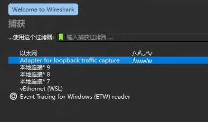

2. 成功进入抓包界面（这时候一直在抓包）

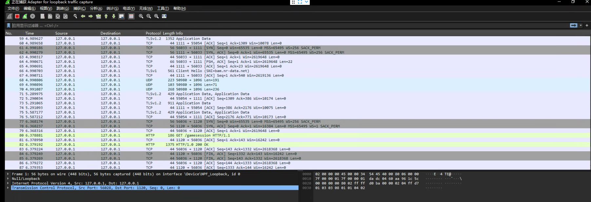
<a name="M3cFG"></a>
### 第六步：启动服务端程序和客户端程序
进入code/TCP文件夹,输入下面的程序启动服务端程序，server.py程序负责接收client端发过来的文件并保存在server_files文件夹中，client.py程序负责使用TCP协议发送文件。
```
# 启动服务端程序
python server.py
# 启动客户端程序
python client.py
```
<a name="BUnWF"></a>
### 第七步：查看捕获的跟踪
可以打开服务端程序和客户端程序，发现使用的是12346端口进行的通信，首先，在Wireshark窗口上方的过滤器（filter）窗口输入“tcp.port==12346”，使得 Wireshark 的数据窗口中只显示和12346端口相关的TCP数据包。在数据窗口中你将看到下面的消息：

1. 你会看见建立连接的过程；
2. 你会看到文件内容的分块传输过程；
3. 你会看到链接终止的过程。
<a name="WGBnV"></a>
# 实验二：捕获局域网内的TCP数据包（必选）
<a name="V6lvj"></a>
## 实验前的准备条件

1. **双人完成（请同学们自由组队，并在实验报告中注明组队成员，每个人只能在一个队伍中）**
2. 安装Wireshark 4.2.0
3. 安装Python3.8
4. 安装Git
<a name="gMpIA"></a>
## 实验目的
通过实验熟悉 Wireshark 抓包软件的使用方法，理解 TCP 传输过程，以及慢启动、拥塞避免等相关技术。<br />熟悉在两台计算机之间进行TCP传输的过程。
<a name="MwA8S"></a>
## 实验步骤
<a name="IPQTh"></a>
## 第一步：保证在一个局域网下
相信同学们都有校园网，在进行实验之前，请同学们连接校园网（手机热点不可以）
<a name="WslbC"></a>
## 第二步：查看自己电脑在校园网下的ip
<a name="QgH4Q"></a>
### Windows：win键+R->输入cmd->输入命令ipconfig
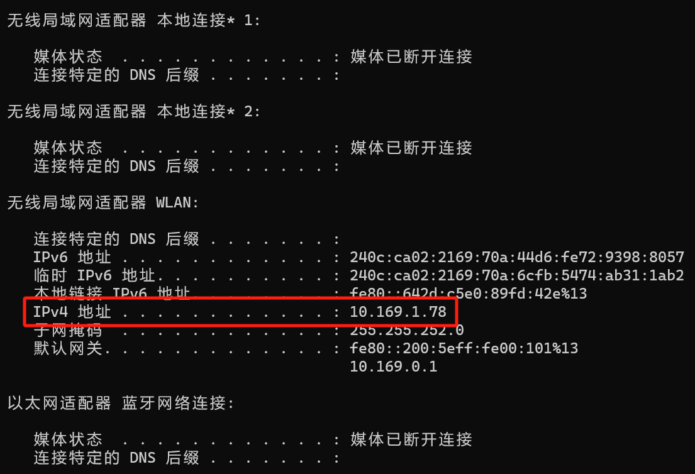
<a name="iP4vd"></a>
### ubuntu:Ctrl+Alt+T->输入命令ifconfig
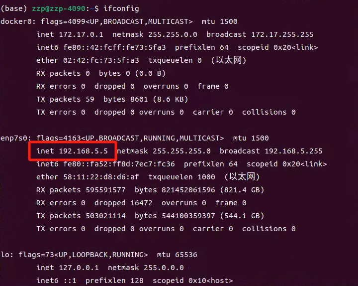
<a name="Uu4Ts"></a>
### macos:打开终端->ifconfig
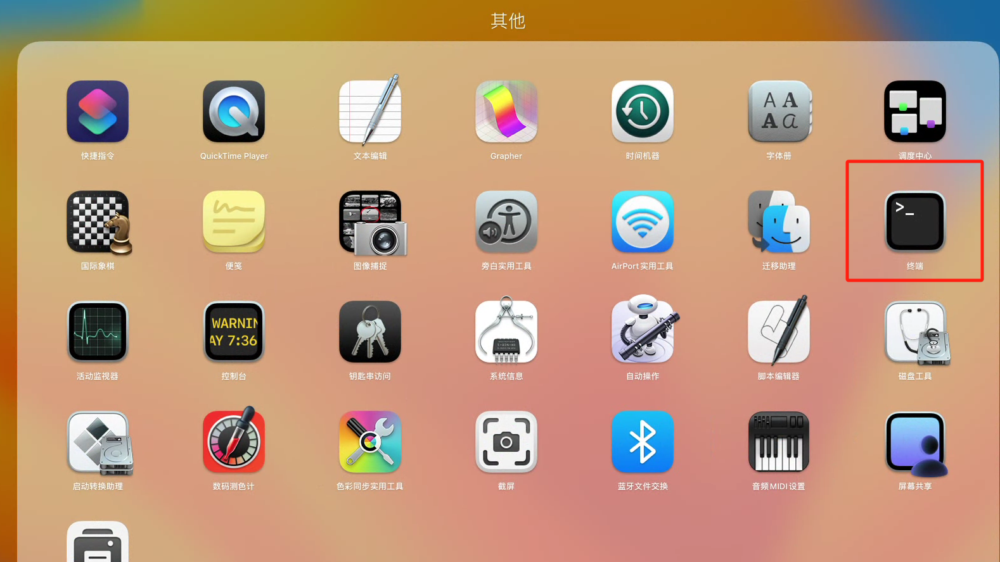<br />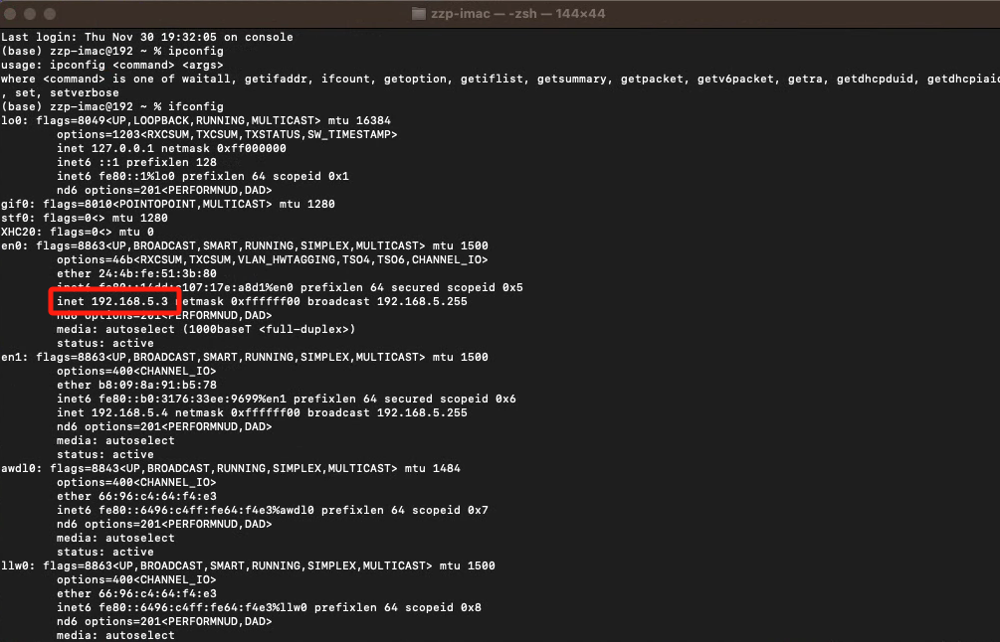
<a name="mtQ1r"></a>
## 第三步：更改服务端程序和客户端程序
请更改服务端程序的代码，将服务端的代码改为一个同学计算机的ip地址，客户端代码改成另一个同学计算机的ip地址。
```
# 定义服务器的IP地址和端口号
server_ip = "127.0.0.1"
server_port = 12346
```
```
注意：端口号原则上没有被计算机占用都可以使用，这里请同学们自行更改，运行服务端程序的计算机需要在防火墙程序中让端口通行，请同学们自行搜索windows/ubuntu/macos防火墙通行端口的方法。强烈不推荐关闭防火墙的方法，这样做虽然也可以完成这个实验，但是你的计算机将直接暴露在网络中。
```
<a name="xpVDa"></a>
## 第四步：仿照实验一的步骤进行文件传输，然后用Wireshark抓包分析
<a name="e96rW"></a>
# 实验报告要求
 注意报告要求： 在回答实验思考题时，应在答案中同时提交含有数据包以及跟踪的打印输出。在这些数据中添加注释来对相应的答案做出解释。 注（一种打印数据包的途径）：文件->打印,勾选 output to file，将数据导出，然后打开文件，选择回答问题所需要的少量数据即可。  <br />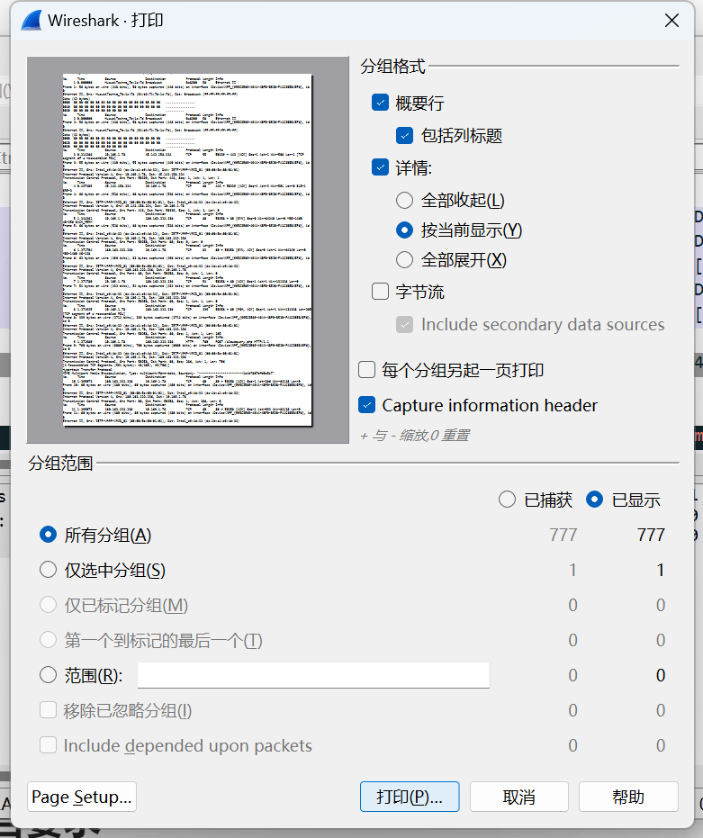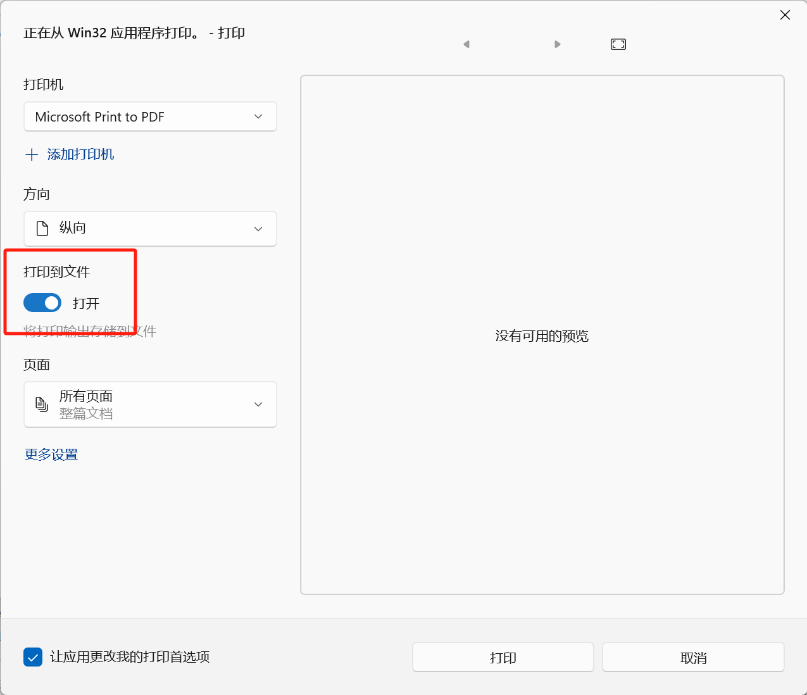
<a name="w6FPd"></a>
## TCP问题

1. 在第一个实验中的客户端程序发送数据的端口是多少，这个端口是谁来决定的？
2. 在第二个实验中服务端程序和客户端程序的ip地址和端口号是什么？
3. 为什么在第一个实验中不需要设置端口的防火墙的通行权限？
4.  在第二个实验中，用来初始化客户端和服务端的 TCP 连接的TCP SYN 报文段的序号是什么？在报文段中，哪个地方表明这是一个 SYN 报文段？  
5.  开始的 6 个 TCP 报文段的长度各自是多少？  
6.  在跟踪文件中，有重传的报文段么？回答这个问题，你需要检查哪个地方？  
7.  接收方在一个 ACK 中，通常确认多少数据？你能辨别出这样一种情形吗：即接收方对收到的报文段，每隔一个确认一次？  
8.  这个 TCP 连接的吞吐量（每单位时间传输的字节数）是多少？解释你是如何计算这个数值的？  
<a name="EwBr0"></a>
## TCP 拥塞控制  
下面我们来观察单位时间内从客户端向服务器的数据量。我们不必对 Wireshark 窗口中 的原始数据进行繁琐的计算，而是通过 Wireshark 的 TCP 画图工具来完成：选择 Time-Sequence-Graph(Stevens) 完成数据的图形显示。选择菜单统计——TCP流图形——图形序列（Stevens） 这里，图中的每个点代表一个发送的TCP段，横坐标代表时间，纵坐标代表TCP段的序 列号。注意那些堆叠在一起的点代表从发送方背靠背连续发送的一系列数据包。<br />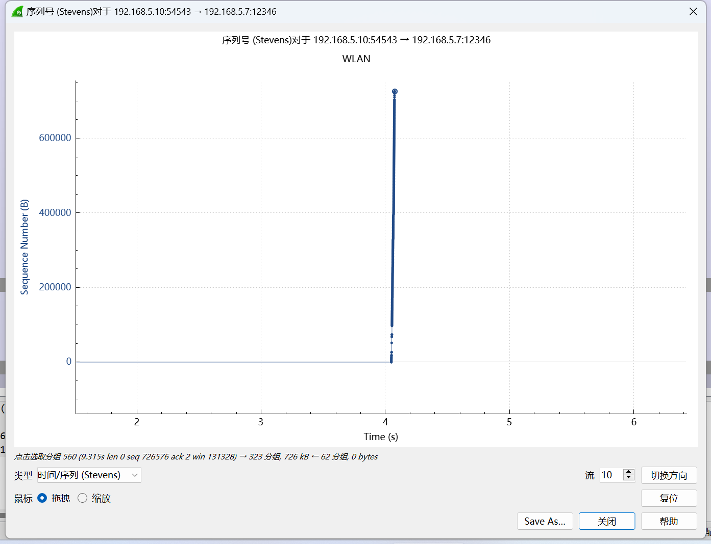
<a name="TyAf4"></a>
### 回答下面的问题

1. 用Time-Sequence-Graph(Stevens)中的画图工具观察从客户端发送到服务器端的TCP段的序列号－时间图。你怎样判断TCP的慢启动(slowstart)开始和结束？拥塞避免在什么地方开始起作用的？注意在实际的跟踪中，不是所有的都像教材那样简单漂亮的形式。同时还要注意在Time-Sequence-Graph(Stevens)中纵坐标所代表的变量与教材中是否不同。
2. 总结这次实验中所得到的 TCP 数据与我们在教材中所学的理想情况有什么不同？  
<a name="WXEit"></a>
# 实验三：微信公众号开发实验（和小程序开发二选一）
<a name="YtnT6"></a>
## 实验前的准备条件
1. 四人一组（每个人只能在一个组中）
2. 请尽量申请免费的云服务器，使用自己有的云服务器也可以
3. 要有明确的分工，每个具体负责那一块要给到助教

## 准备工作
电脑浏览器打开[微信公众平台 (qq.com)](https://mp.weixin.qq.com/)，点击立即注册如下图所示。<br />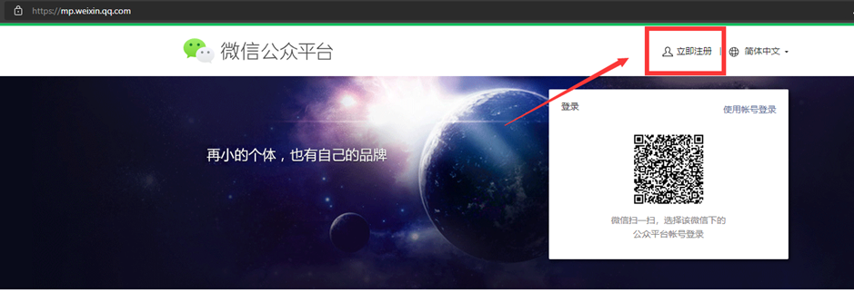<br />点击注册账号的类型是订阅号，填写信息点击注册即可。如下所示。<br />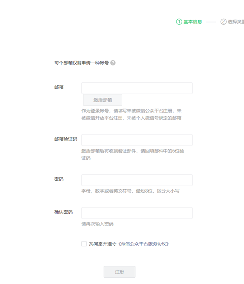
<a name="wERG9"></a>
## 公众号设置
<a name="E96aF"></a>
### 修改名称
登录公众号平台[微信公众平台 (qq.com)](https://mp.weixin.qq.com/)，点击左侧设置与开发->公众号设置->修改名称。不修改名称账号会自动注销。
<a name="VgXVT"></a>
### 绑定开发者微信号
点击左侧设置与开发->基本配置，成为开发者。点击左侧设置与开发->web开发者工具->绑定开发者微信号。
<a name="ynfn3"></a>
### 配置服务器
大家需要去腾讯云（或阿里云，华为云）申请云服务器，选择系统镜像为Ubuntu，配置选最低即可，然后点击开发->基本配置->服务器配置，如图4所示。点击修改配置，这里需要分三步走：
<a name="WT8Vd"></a>
#### 第一步
安装web库
```
#使用python
pip install web.py
```
或
```
#使用python3
pip3 install web.py
```
<a name="fj4H6"></a>
#### 第二步
新建main.py，将下面的代码复制到main.py，main.py负责监听80端口返回给前端信息
```
# coding=UTF-8
import web
from handle import Handle

urls = (
    '/wx', 'Handle',
)

if __name__ == '__main__':
    app = web.application(urls, globals())
    app.run()

```
<a name="DbVXo"></a>
#### 第三步
新建handle.py，将下面的代码复制到handle.py，handle.py负责接口验证Token，将token、timestamp、nonce三个参数进行字典序排序，将三个参数字符串拼接成一个字符串进行sha1加密 ，开发者获得加密后的字符串可与signature对比，标识该请求来源于微信，注意需要将第15行的xxxx替换成自己设置的Token，这里Token可以自己随便设置，只能是数字和字母，3-32字符
```
# coding=UTF-8
#handle.py
import hashlib
import web
import sys

class Handle(object):
    def GET(self):
        try:
            data = web.input()
            if len(data) == 0:
                return "hello, this is handle view"
            signature = data.signature
            timestamp = data.timestamp
            nonce = data.nonce
            echostr = data.echostr
            token = "xxxx"#这里需要将xxxx替换成自己设置的Token
            list = [token, timestamp, nonce]
            list.sort()
            sha1 = hashlib.sha1()
            # map(sha1.update, list)
            sha1.update(list[0].encode('utf-8'))
            sha1.update(list[1].encode('utf-8'))
            sha1.update(list[2].encode('utf-8'))
            hashcode = sha1.hexdigest()
            print ("handle/GET func: hashcode, signature: ", hashcode, signature)
            
            if hashcode == signature:
                return int(echostr)
            else:
                return ""
        except Exception as Argument:
            return Argument

```
<a name="AyUR4"></a>
#### 第四步：
将上面的两个文件拷贝到云服务器，可以用Xftp 7软件(学生可以免费申请，链接在[XSHELL - NetSarang Website](https://www.netsarang.com/zh/xshell/)，如下图所示，进入页面点击下载，点击免费授权页面，填入信息即可，建议Xshell和Xftp一起安装，Xshell可以用来链接云服务器)，然后安装依赖环境，在云服务器命令行里输入一下代码即可：
```
pip install werobot
#然后用命令sudo python main.py 80运行
或
pip3 install werobot
#然后用命令sudo python3 main.py 80运行
```
<a name="j1KJW"></a>
#### 第五步
填写如图3的服务器地址(URL)为：http://云服务器外网地址/wx或者https://云服务器外网地址/wx，如果没有设置证书的话一般是http
令牌(Token)：自己随便设置，注意和handle.py中的token必须一样<br />消息加解密密钥：随机<br />消息加解密方式：为了方便开发，明文模式然后点击验证token，成功之后点击启用服务器，到这里服务器配置完成。<br />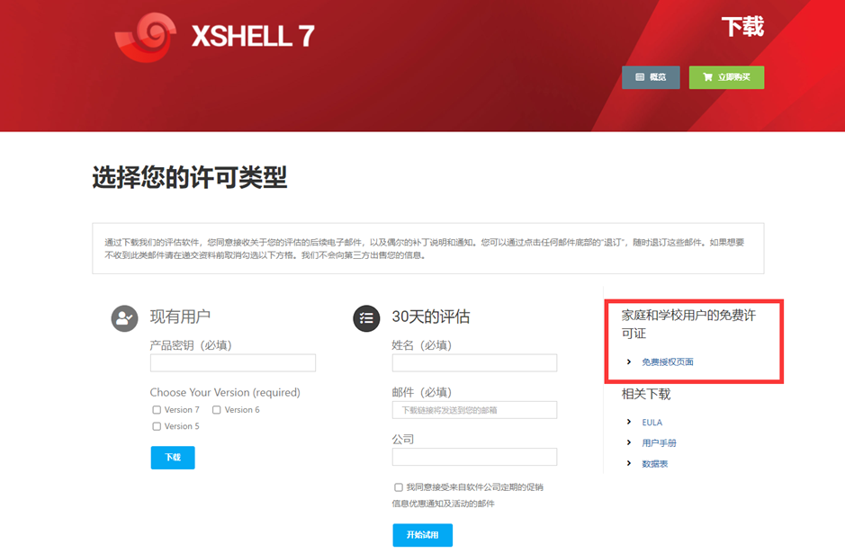<br />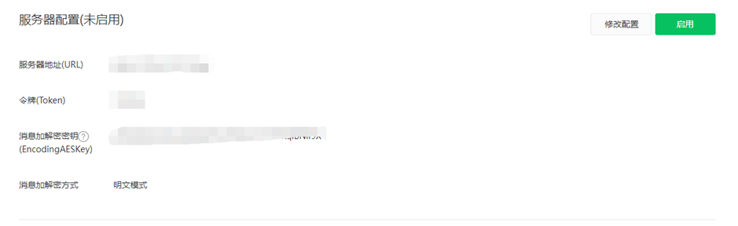
<a name="SXtkI"></a>
### 接口
<a name="LM1K3"></a>
#### 微信公众平台接口调试工具
可以通过这个链接测试接口[微信公众平台接口调试工具 (qq.com)](https://mp.weixin.qq.com/debug/)，或者用postman测试也可以
<a name="Zog8J"></a>
#### 获取Access Token
官方API：[https://api.weixin.qq.com/cgi-bin/token?grant_type=client_credential&appid=APPID&secret=APPSECRET](https://api.weixin.qq.com/cgi-bin/token?grant_type=client_credential&appid=APPID&secret=APPSECRET)<br />其中需要将[APPID](https://api.weixin.qq.com/cgi-bin/token?grant_type=client_credential&appid=APPID&secret=APPSECRET)替换为自己的APPID，将[APPSECRET](https://api.weixin.qq.com/cgi-bin/token?grant_type=client_credential&appid=APPID&secret=APPSECRET)替换为自己的[APPSECRET](https://api.weixin.qq.com/cgi-bin/token?grant_type=client_credential&appid=APPID&secret=APPSECRET)
<a name="K8SKO"></a>
#### 开发者文档
[微信公众平台开发概述 |微信开放文档 (qq.com)](https://developers.weixin.qq.com/doc/offiaccount/Getting_Started/Overview.html)
<a name="jxSL2"></a>
#### 全局状态码说明
[微信开放文档 (qq.com)](https://developers.weixin.qq.com/doc/offiaccount/Getting_Started/Global_Return_Code.html)
<a name="PNk1e"></a>
## 实验环境总结（开发必看）
<a name="Nst4w"></a>
### 服务器环境
云服务器，ubuntu系统，最小配置(1核 2GB 1Mbps)，python 2.7及其以上
<a name="fR6Kd"></a>
### 微信公众号设置
注册微信公众号，通过验证Token将公众号与服务器绑定，在服务器代码里加入公众号实现的功能，开发语言python
<a name="f6b3z"></a>
### 微信公众号开发框架
werobot开发框架，使用文档见https://werobot.readthedocs.io/zh_CN/latest/。如果不适用该框架也可以，参照[微信公众平台开发概述 |微信开放文档 (qq.com)](https://developers.weixin.qq.com/doc/offiaccount/Getting_Started/Overview.html)使用官方的文档进行开发。
<a name="zlDUR"></a>
## 实验demo
本次指导书使用werobot开发框架进行演示，开发文档见https://werobot.readthedocs.io/zh_CN/latest/。
<a name="baWdh"></a>
### 自定义回复
在服务器端运行webserver.py，代码如下：文本信息回复代码在第6行到第8行，功能是将用户发送到公众号的消息发送给原用户，图片信息回复在第11行到第13行，功能是将用户发送到公众号的图片链接发送给原用户，效果如下图所示。
```
# coding=UTF-8
#webserver.py基于werobot开发框架的自定义回复功能
import werobot

robot = werobot.WeRoBot(token='xxxx')#这里需要将xxxx替换成自己设置的Token,和handle.py文件中以及配置服务器的Token一致

# @robot.text 修饰的 Handler 只处理文本消息
@robot.text
def echo(message):
    return message.content

# @robot.image 修饰的 Handler 只处理图片消息
@robot.image
def img(message):
    return message.img

@robot.text
def first(message, session):
    if 'first' in session:
        return '你之前给我发过消息'
    session['first'] = True
    return '你之前没给我发过消息'

# 让服务器监听在 0.0.0.0:80
robot.config['HOST'] = '0.0.0.0'
robot.config['PORT'] = 80
robot.run()
```
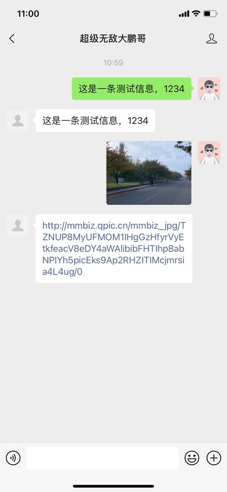
<a name="JmjZE"></a>
### 自定义回复-查询天气
这里介绍一个发送公众号关键词”天气&地名“，返回查询地天气信息的功能。<br />第一步：随便找一个免费的API，比如:http://wthrcdn.etouch.cn/weather_mini?city=青岛,Get方法，复制postman测试接口会得到天气信。我们把加入webserver.py中，webserver.py完整的代码如下所示，得到的结果如下图所示。
```
# coding=UTF-8
import werobot
import requests
import json

robot = werobot.WeRoBot(token='123456')

# @robot.text 修饰的 Handler 只处理文本消息
@robot.text
def echo(message):
    #判断如果关键词里有"天气"
    if "天气" in message.content:
        #比如输入为"天气&北京"，partition()将输入变为含有三个元素{"天气"，"&"，"北京"}数组
        ret = message.content.partition('&')
        #提取城市名
        addr = ret[2]
        #调用查询天气API，自己可以更换，网上有很多免费的API
        url = 'http://wthrcdn.etouch.cn/weather_mini?city=' + addr
        response = requests.get(url=url)
        result=json.loads(response.text)
        #解析json
        data = result["data"]["forecast"][0]["date"]
        high = result["data"]["forecast"][0]["high"]
        fengli = result["data"]["forecast"][0]["fengli"]
        low = result["data"]["forecast"][0]["low"]
        fengxiang = result["data"]["forecast"][0]["fengxiang"]
        tian = result["data"]["forecast"][0]["type"]
        return "时间：" + data + "\n最好气温：" + high + "\n最低气温：" + low + "\n风向：" + fengxiang + "\n天气：" +tian
    else:
        return message.content

# @robot.image 修饰的 Handler 只处理图片消息
@robot.image
def img(message):
    return message.img

@robot.text
def first(message, session):
    if 'first' in session:

```
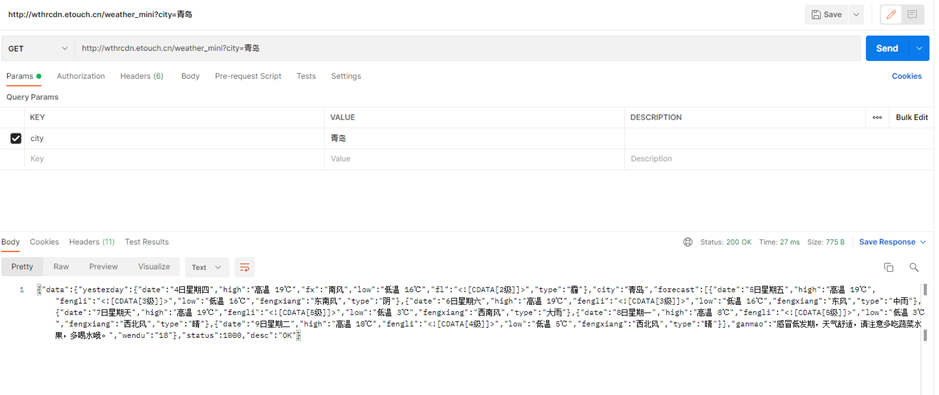<br />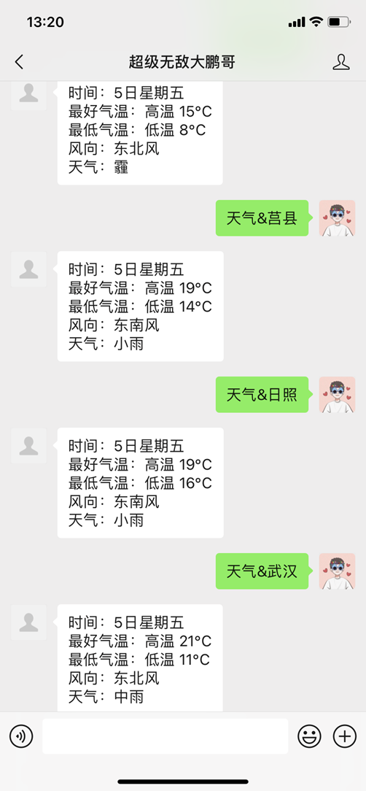
<a name="qBmdd"></a>
## 实验任务

1. 跑通实验demo；
2. 开发自己的微信公众号。
<a name="qBS0u"></a>
# 实验四：微信小程序实验（和公众号开发二选一）
<a name="RuRAS"></a>
## 实验前的准备条件
1. 四人一组（每个人只能在一个组中）
2. 请尽量申请免费的云服务器，使用自己有的云服务器也可以
3. 要有明确的分工，每个具体负责那一块要给到助教
## 准备工作
<a name="SctZg"></a>
### 登录开发者网站
登录开发者网站[微信公众平台 (qq.com)](https://mp.weixin.qq.com/)，手机端选择小程序登录，如下图所示。<br />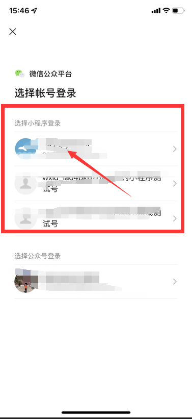
<a name="vlt5J"></a>
### 完善开发者信息
登录之后，点击左侧的首页，参照“小程序发布流程”，如下图所示，依次进行以下操作：<br />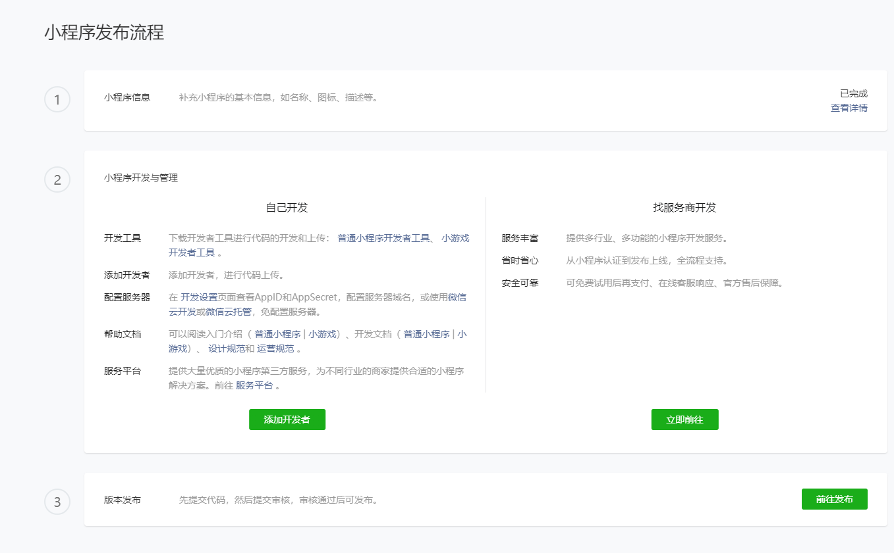
<a name="rYAv6"></a>
#### 补充小程序的基本信息；
<a name="Giv1N"></a>
#### 下载普通小程序开发者工具，添加开发者
这一步可以添加一起做开发的小组成员，如果是自己单独开发，就不需要添加了，做多添加15个开发者。
<a name="skj0c"></a>
#### 配置服务器
后端服务器有两种类型，一个是自己配置的服务器，需要自己设置；另外一种是使用微信官方的云服务，免费，使用起来也比较方便，推荐使用。
<a name="tiV2H"></a>
#### 自定义服务器
如下图所示，点击开发配置，再点击生成小程序密钥，注意保存小程序密钥，网站不保存密钥，还可以将自己服务器的IP地址添加到IP白名单。接下来需要配置服务器域名。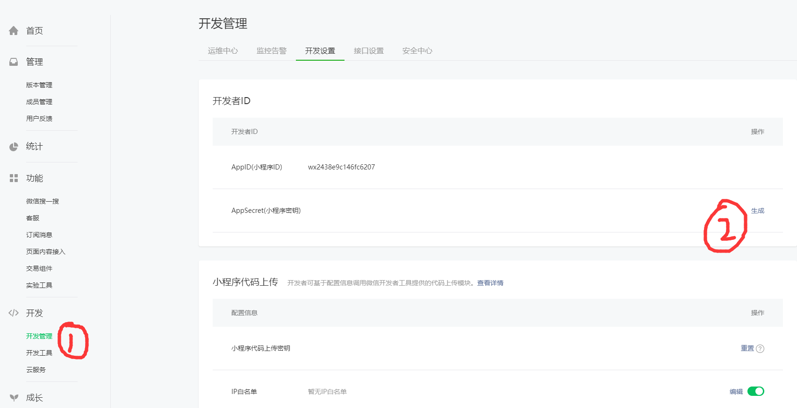
<a name="mDpra"></a>
#### **云服务开发**
点击开发->云服务，点击云开发，可以查看开通的免费的服务器。在开发工具如图4所示的位置也可以选择云开发。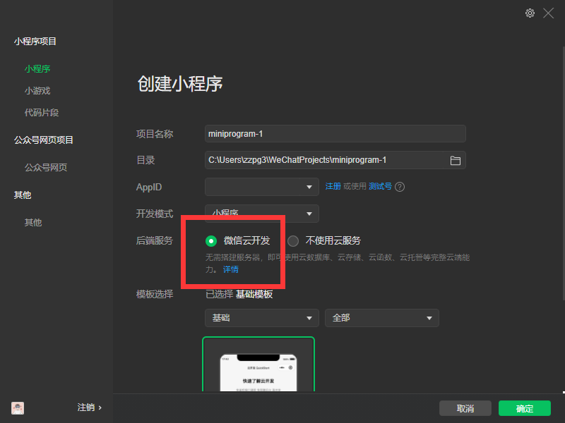
<a name="zcrkZ"></a>
### 开发环境
<a name="qVXfs"></a>
#### 新建项目
前往开发工具下载地址[稳定版 Stable Build | 微信开放文档 (qq.com)](https://developers.weixin.qq.com/miniprogram/dev/devtools/download.html)，根据自己的操作系统下载相应的版本。打开之后，注意填入图5框中的AppID，后端服务推荐选择云服务，语言就可以选择JS，也可以是TS，这里选择用JS演示。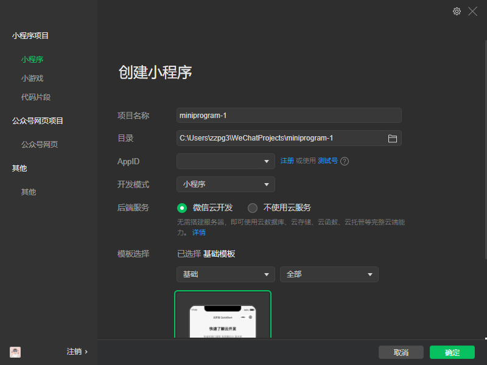
<a name="Ra9Q4"></a>
#### 编译预览
如下图所示，点击红框内的编译，点击预览，可产生一个二维码，用手机扫码即可预览开发的小程序。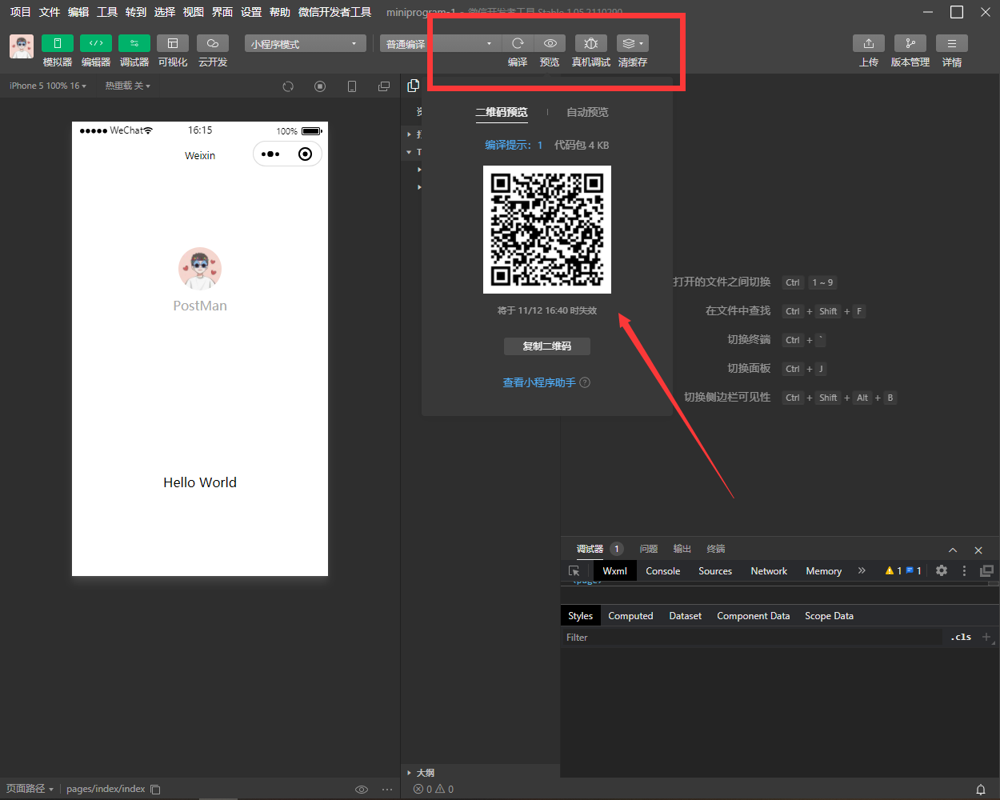
<a name="nYG4g"></a>
#### 云服务介绍
点击下图红框位置的云开发，可以看到有数据库，云函数等功能可以使用，微信云开发是微信团队联合腾讯云推出的专业的小程序开发服务。开发者可以使用云开发快速开发小程序、小游戏、公众号网页等，并且原生打通微信开放能力。开发者无需搭建服务器，可免鉴权直接使用平台提供的 API 进行业务开发。详细的开发文档在[快速开始：小程序/小游戏 | 微信开放文档 (qq.com)](https://developers.weixin.qq.com/miniprogram/dev/wxcloud/quick-start/miniprogram.html)<br />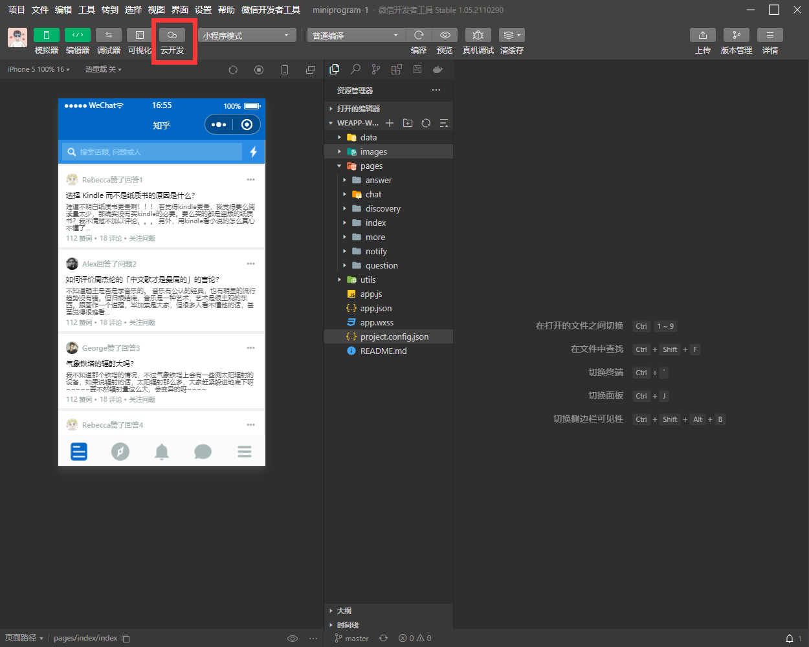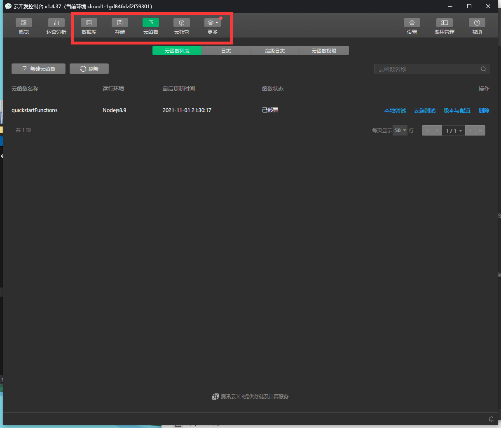
<a name="PSlt9"></a>
## 微信小程序demo
前往 [https://github.com/zhaozhipeng1997/wxdemo](https://github.com/zhaozhipeng1997/wxdemo) ，下载代码，解压用微信开发者工具导入，编译运行，如图8所示。运行没有问题之后，点击上传即可。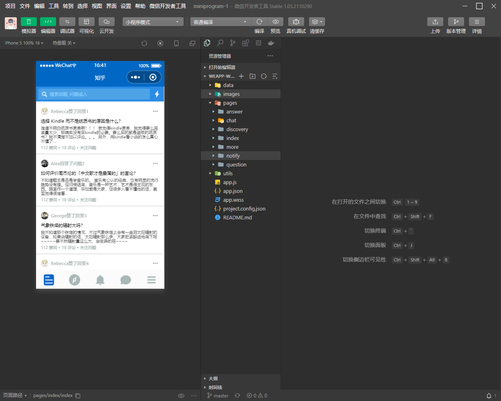
<a name="STPTG"></a>
## 发布小程序
回到“小程序发布流程”，第三步点击前往发布，如下图所示。找到自己提交的开发版本，提交审核即可。审核通过即可上线。<br />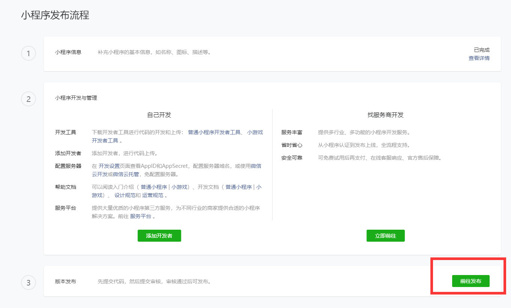
